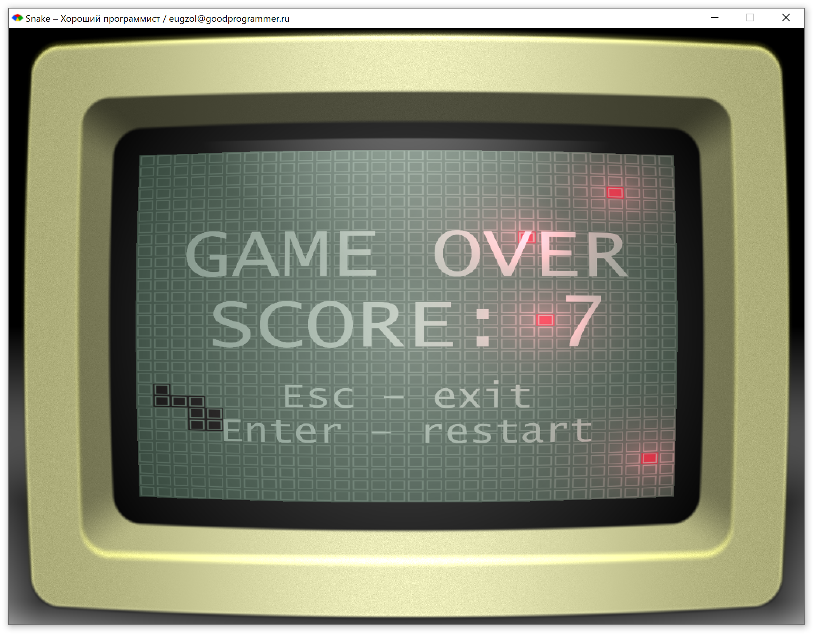

# "Змейка"!



# Установка под Windows

* [Ruby + DevKit](https://rubyinstaller.org/downloads/)

```
gem install gosu
gem install opengl

ruby windows_main.rb
```
# Управление

* WASD - передвижение
* Space - ночной режим
* Esc – выход
* Enter – рестарт

# Использованный код

* Gosu + обучающие материалы: https://github.com/gosu/gosu
* Шейдер ЭЛТ-дисплея: https://www.shadertoy.com/view/XdtfzX
* Шейдер освещения: https://github.com/mattdesl/lwjgl-basics/wiki/ShaderLesson6
* Использование полноэкранных шейдеров в Gosu: https://www.libgosu.org/cgi-bin/mwf/topic_show.pl?tid=236
* Современная упрощённая инициализация полноэкранных шейдеров: https://community.khronos.org/t/draw-with-fragment-shader-without-vertices/70964

Создано специально для "Хорошего программиста" – [GoodProgrammer.ru](https://goodprogrammer.ru)

# Использованные ресурсы

* https://bleeoop.itch.io/interface-bleeps
* https://www.youtube.com/watch?v=Nwj8nfsk2Hs
